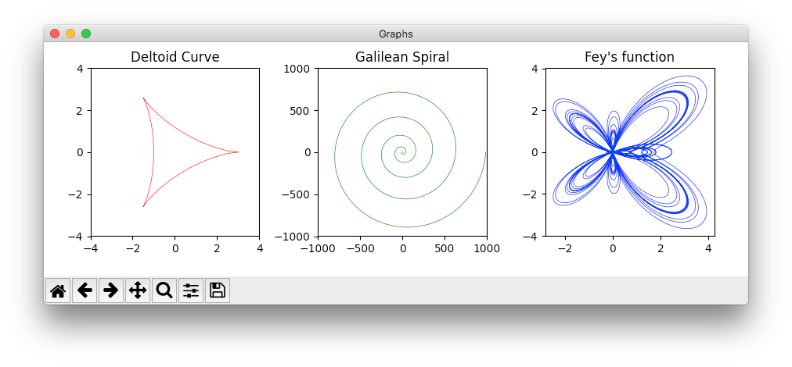
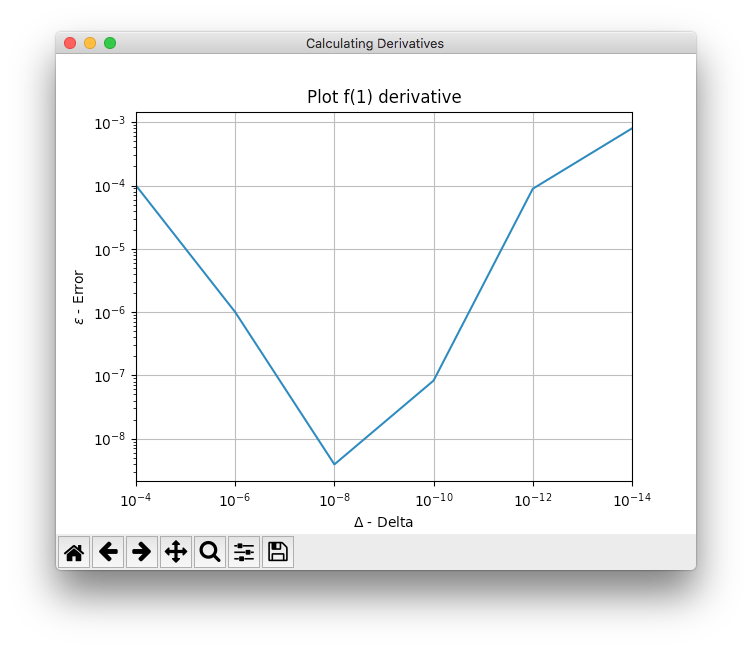
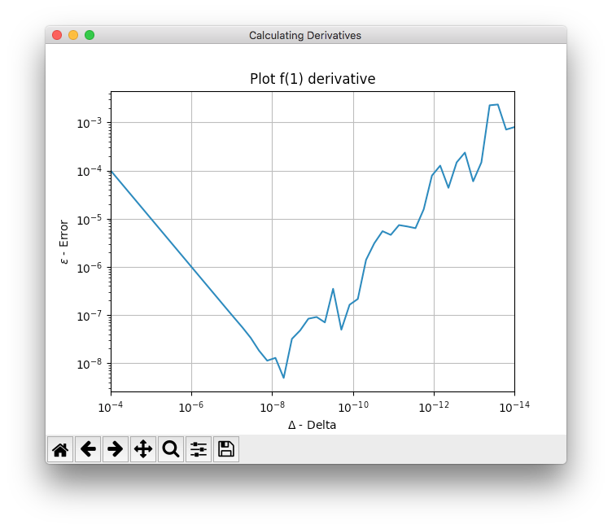
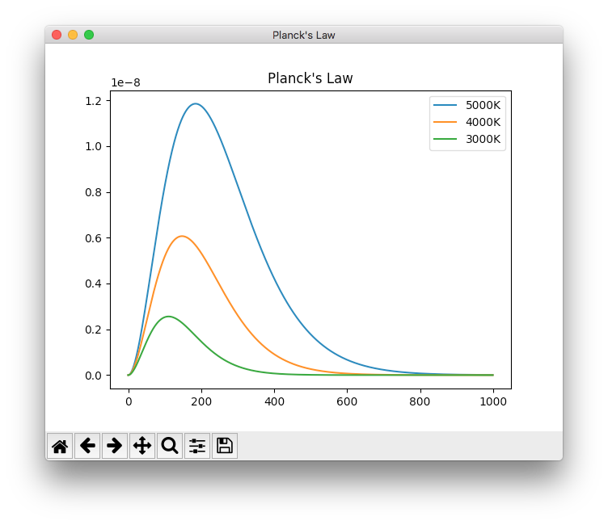
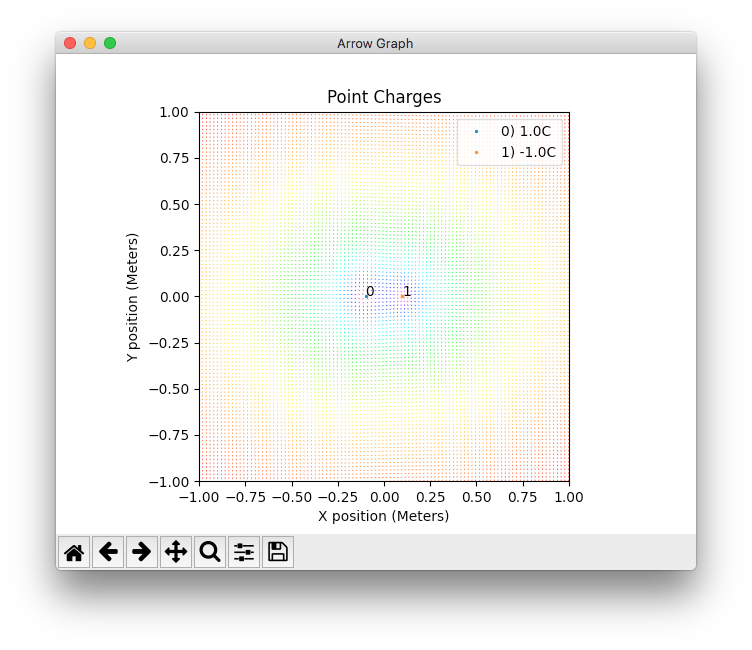
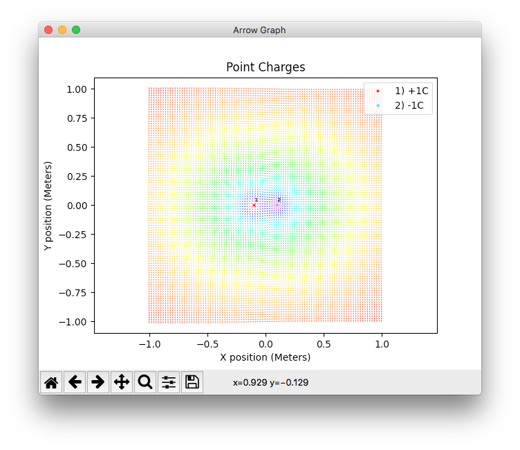
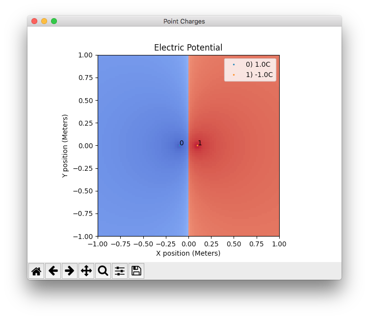
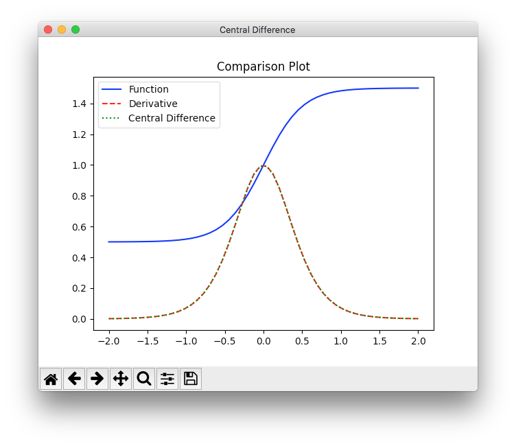
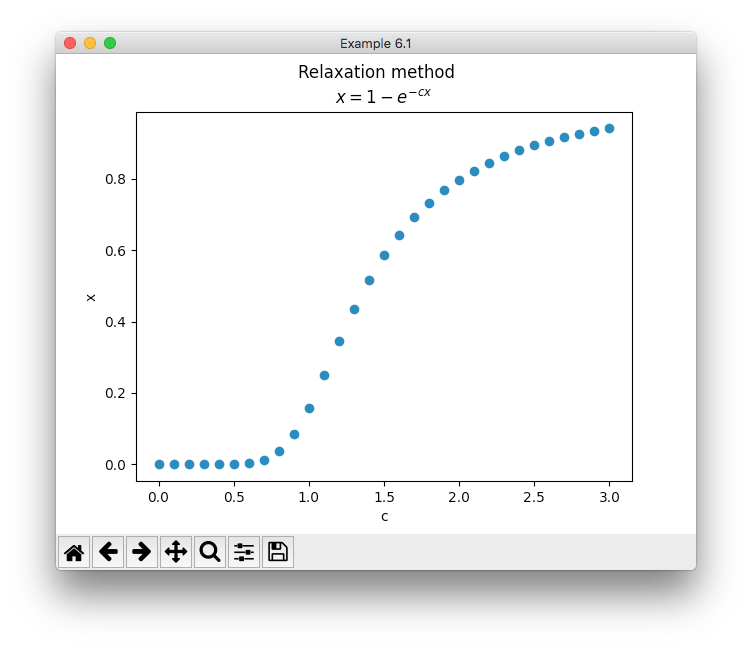
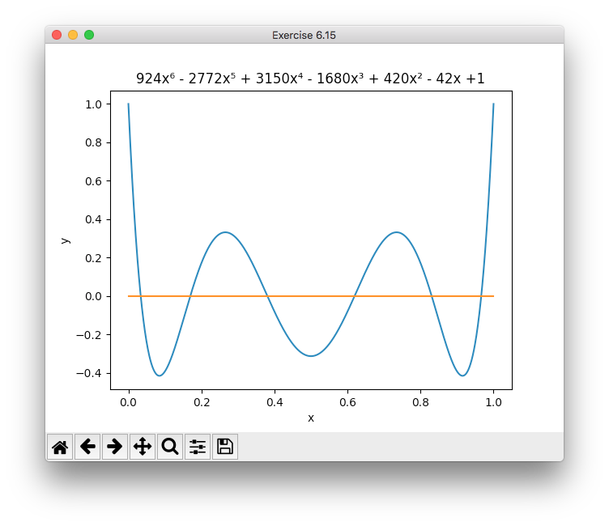

# KA_PHYS: PHYS 4100/4150

python3 should be used to run scripts to avoid issues with special characters in comments.

## PHYS 4150

### BallDrop.py
```
python3 BallDrop.py
Exercise 2.1 - Ball Drop
Height of ball (meters):100
The ball will take approximately 4.5152 seconds to hit the ground.
```
```
python3 BallDrop.py --height 100
Exercise 2.1 - Ball Drop
The ball will take approximately 4.5152 seconds to hit the ground.
```

### RelativisticSpaceship.py
```
python3 RelativisticSpaceship.py
Exercise 2.4 - Spaceship
Distance (light years):10
Speed (Decimal fraction speed of light):.99
The observer on earth expects the spaceship to reach its target in ~10.101 years.
The observer on the spaceship perceives ~1.4249 years elapsing before reaching the planet.
```
```
python3 RelativisticSpaceship.py --distance 10 --speed 0.99
Exercise 2.4 - Spaceship
The observer on earth expects the spaceship to reach its target in ~10.101 years.
The observer on the spaceship perceives ~1.4249 years elapsing before reaching the planet.
```

### CurvePlotting.py
```
python3 CurvePlotting.py
```



### CalculatingDerivatives.py
```
python3 CalculatingDerivatives.py 
Example 4.3

Derivative at x = 1 delta = 0.01: (truncated)

	Approximation: 1.010000
	Actual Stored: 1.000000

NOTE: Expect approximation to differ significantly with large delta. Reducing delta will result in improved accuracy until a point at which error will compound due to machine precision.

Graphs displayed show as delta decreases error will correspondingly decrease. 
    When delta becomes to small error will increase due to accumulation of errors due to machine precision.
```
```
python3 CalculatingDerivatives.py --x 2 --delta 0.0001
Example 4.3

Derivative at x = 2.0 delta = 0.0001: (truncated)

	Approximation: 3.000100
	Actual Stored: 3.000000

NOTE: Expect approximation to differ significantly with large delta. Reducing delta will result in improved accuracy until a point at which error will compound due to machine precision.

Graphs displayed show as delta decreases error will correspondingly decrease. 
    When delta becomes to small error will increase due to accumulation of errors due to machine precision.
```




### CalculatingIntegrals.py
```
time python3 CalculatingIntegrals.py 
Calculated: 1.56913425554925 (100 iterations)
Calculated: 1.570796326742306 (10000000 iterations)
Actual:     1.57079632679489661923132169163975144209858469968
Using 10 million iterations the value calculated is accurate to 10 decimal places.

real	0m0.613s
user	0m0.393s
sys	0m0.195s
```

### Stefan-Boltzmann.py

# NOTE: OUTPUT HAS NOT BEEN UPDATED FOR RECENT CODE CHANGES.

```
python3 Stefan-Boltzmann.py 
WARNING: Units returned do not match.
Calculated: 5.670374419184432e-08 J / (K4 m2 s)
Scipy:      5.6703744191844314e-08 W / (K4 m2)
NIST:       5.670374419... x 10-8 W m-2 K-4
```


### Electric.py
```
python3 Electric.py
5.21: Electric field of a charge distribution
```



```
python3 Electric.py --widecolor
5.21: Electric field of a charge distribution
```



## PHYS 4100

### BallDropTime.py
```
python3 BallDropTime.py 
Example 2.1
Height of tower (meters):10
  Time Elapsed (seconds):1
The ball is ~5.095 meters above the ground.
```

### Catalan.py
```
python3 Catalan.py
Catalan(n):20
6564120420
```

### NumpyArrays.py
```
python3 NumpyArrays.py 
[3. 3. 3. 3.]
[1.         1.33333333 1.5        1.6       ]
[1 1 1 1]
```

### MachinePrecision.py
```
python3 MachinePrecision.py 
2.220446049250313e-16
```

### Float.py
```
python3 Float.py
<class 'float'>
        0.10000000000000000555
```

### Difference.py
```
python3 Difference.py
1.4210854715202004
1.4142135623730951
```

### Quadratic.py
```
python3 Quadratic.py
Solution for a=0.001, b=1000, c=0.001:
Roots-Standard Formula:  -999999.999999 -9.99989424599e-07
Roots-Alternate Formula: -1000010.57551 -1e-06
Roots-Numpy:             -999999.999999 -1e-06
a:1
b:-8
c:12
Roots-Standard Formula:  2.0 6.0
Roots-Alternate Formula: 2.0 6.0
Roots-Numpy:             2.0 6.0
```

```
python3 Quadratic.py
Solution for a=0.001, b=1000, c=0.001:
Roots-Standard Formula:  -999999.999999 -9.99989424599e-07
Roots-Alternate Formula: -1000010.57551 -1e-06
Roots-Numpy:             -999999.999999 -1e-06
a:1
b:4
c:5
Roots-Standard Formula:  (-2+1j) (-2-1j)
Roots-Alternate Formula: (-2-1j) (-2+1j)
Roots-Numpy:             (-2+1j) (-2-1j)
```

### Integration.py
```
python3 Integration.py 
Trapezoidal method = 4.50656            (  10 slices)
Trapezoidal method = 4.401066656        ( 100 slices)
Trapezoidal method = 4.4000106666656    (1000 slices)
  Simpson's method = 4.400426666666667  (  10 slices)
  Simpson's method = 4.400000042666668  ( 100 slices)
  Simpson's method = 4.400000000004266  (1000 slices)
Simpson's Error <    0.00002666666666666373
```

### QuantumHarmonicOscillator.py
```
time python3 QuantumHarmonicOscillator.py 
Average Energy = 99.9554313409348 (1000 iterations)
Average Energy = 100.000833331944 (1000000 iterations)
Average Energy = 99.0107219866263 (1000000000 iterations)

real	15m2.296s
user	0m34.584s
sys	1m27.088s
```

### Gaussian.py
```
python3 Gaussian.py 
Value: 4.400000000000037
```

### CentralDifference.py
```
python3 CentralDifference.py
```


### Resistors.py
```
python3 Resistors.py 
Exercise 6.1 - Resistors Circuit - Junction Voltage Solver

V1 Equation: ([V1]-[V+])/R +([V1]-[V2])/R +([V1]-[V3])/R +([V1]-[V4])/R 
V2 Equation: ([V2]-[V1])/R +([V2]-[V4])/R +([V2]-[V-])/R 
V3 Equation: ([V3]-[V+])/R +([V3]-[V1])/R +([V3]-[V4])/R 
V4 Equation: ([V4]-[V1])/R +([V4]-[V2])/R +([V4]-[V3])/R +([V4]-[V-])/R 
____
Matrix:
[[ 4. -1. -1. -1.  5.]
 [-1.  3.  0. -1.  0.]
 [-1.  0.  3. -1.  5.]
 [-1. -1. -1.  4.  0.]]
____
Row 0: Divide by 4.
[[ 1.   -0.25 -0.25 -0.25  1.25]
 [-1.    3.    0.   -1.    0.  ]
 [-1.    0.    3.   -1.    5.  ]
 [-1.   -1.   -1.    4.    0.  ]]
____
Rows 1, 2 & 3: Add Row 0.
[[ 1.   -0.25 -0.25 -0.25  1.25]
 [ 0.    2.75 -0.25 -1.25  1.25]
 [ 0.   -0.25  2.75 -1.25  6.25]
 [ 0.   -1.25 -1.25  3.75  1.25]]
____
Row 1: Multiply by 2.75.
[[ 1.         -0.25       -0.25       -0.25        1.25      ]
 [ 0.          1.         -0.09090909 -0.45454545  0.45454545]
 [ 0.         -0.25        2.75       -1.25        6.25      ]
 [ 0.         -1.25       -1.25        3.75        1.25      ]]
____
Row 0: Subtract Row 2.
[[ 1.          0.         -3.          1.         -5.        ]
 [ 0.          1.         -0.09090909 -0.45454545  0.45454545]
 [ 0.         -0.25        2.75       -1.25        6.25      ]
 [ 0.         -1.25       -1.25        3.75        1.25      ]]
____
Row 2: Multiply by 4 then add Row 1.
[[ 1.          0.         -3.          1.         -5.        ]
 [ 0.          1.         -0.09090909 -0.45454545  0.45454545]
 [ 0.          0.         10.90909091 -5.45454545 25.45454545]
 [ 0.         -1.25       -1.25        3.75        1.25      ]]
____
Row 3: Divide by 1.25 then add Row 1.
[[ 1.          0.         -3.          1.         -5.        ]
 [ 0.          1.         -0.09090909 -0.45454545  0.45454545]
 [ 0.          0.         10.90909091 -5.45454545 25.45454545]
 [ 0.          0.         -1.09090909  2.54545455  1.45454545]]
____
Row 2: Divide by the value of (2nd row, 2nd column).
[[ 1.          0.         -3.          1.         -5.        ]
 [ 0.          1.         -0.09090909 -0.45454545  0.45454545]
 [ 0.          0.          1.         -0.5         2.33333333]
 [ 0.          0.         -1.09090909  2.54545455  1.45454545]]
____
Row 1: Subtract Row 3.
[[ 1.          0.         -3.          1.         -5.        ]
 [ 0.          1.          1.         -3.         -1.        ]
 [ 0.          0.          1.         -0.5         2.33333333]
 [ 0.          0.         -1.09090909  2.54545455  1.45454545]]
____
Row 3: Divide by the value of (3rd row, 2nd column).
[[ 1.          0.         -3.          1.         -5.        ]
 [ 0.          1.          1.         -3.         -1.        ]
 [ 0.          0.          1.         -0.5         2.33333333]
 [-0.         -0.          1.         -2.33333333 -1.33333333]]
____
Row 3: Subtract Row 2.
[[ 1.          0.         -3.          1.         -5.        ]
 [ 0.          1.          1.         -3.         -1.        ]
 [ 0.          0.          1.         -0.5         2.33333333]
 [-0.         -0.          0.         -1.83333333 -3.66666667]]
____
Row 3: Divide by the value of (3rd row, 3rd column).
[[ 1.          0.         -3.          1.         -5.        ]
 [ 0.          1.          1.         -3.         -1.        ]
 [ 0.          0.          1.         -0.5         2.33333333]
 [ 0.          0.         -0.          1.          2.        ]]
____
Row 2: Add the value of (.5 times Row 3).
[[ 1.          0.         -3.          1.         -5.        ]
 [ 0.          1.          1.         -3.         -1.        ]
 [ 0.          0.          1.          0.          3.33333333]
 [ 0.          0.         -0.          1.          2.        ]]
____
Row 1: Subtract Row 1 then add (3 times Row 3).
[[ 1.          0.         -3.          1.         -5.        ]
 [ 0.          1.         -0.          0.          1.66666667]
 [ 0.          0.          1.          0.          3.33333333]
 [ 0.          0.         -0.          1.          2.        ]]
____
Row 1: Add (3 times Row 2) then subtract Row 3.
[[ 1.          0.          0.          0.          3.        ]
 [ 0.          1.         -0.          0.          1.66666667]
 [ 0.          0.          1.          0.          3.33333333]
 [ 0.          0.         -0.          1.          2.        ]]
____
        Manual RREF : [3.         1.66666667 3.33333333 2.        ]
Numpy linalg.solve(): [3.         1.66666667 3.33333333 2.        ]
           Reference: [3, 1.6666666666666667, 3.3333333333333335, 2]
```

### Relax.py
```
python3 Relax.py
Initial guess 0, found x as 0.0 = 0.0. 
  Steps: [0, 0.0]
Initial guess 1, found x as 0.7974866394625985 = 0.797086049491047. 
  Steps: [1, 0.8646647167633873, 0.8225966691808597, 0.8070247503317746, 0.8009201942366403, 0.7984747083247583, 0.7974866394625985]
```



### Polynomial.py
```
python3 Polynomial.py 
Roots calculated using Newton's method: [0.03375385702827303, 0.16939530343350165, 0.38069040695837275, 0.6193095931395461, 0.8306046932349481, 0.966234757110526]
Actual Approximate Roots:0.0337652428984239860938492 0.1693953067668677431693002 0.3806904069584015456847491 0.6193095930415984543152509 0.8306046932331322568306998 0.9662347571015760139061508
```

